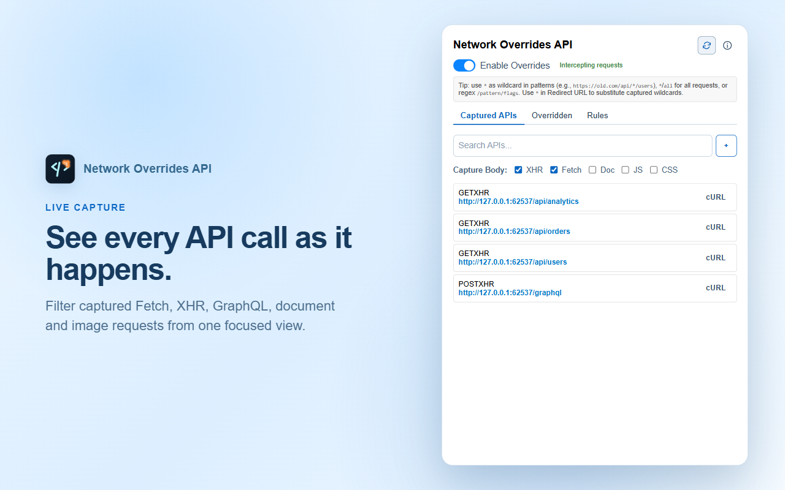
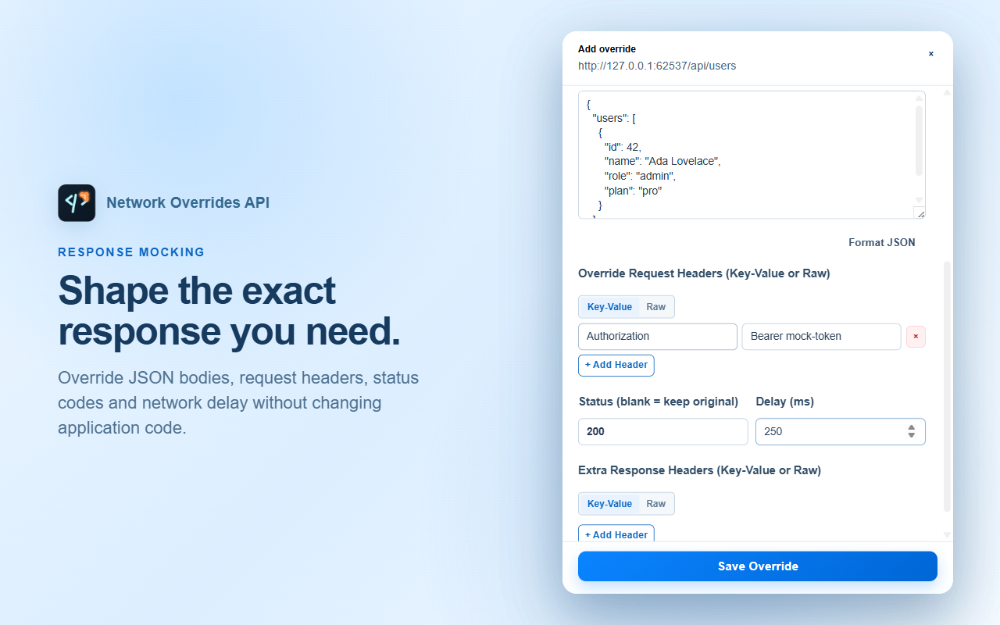
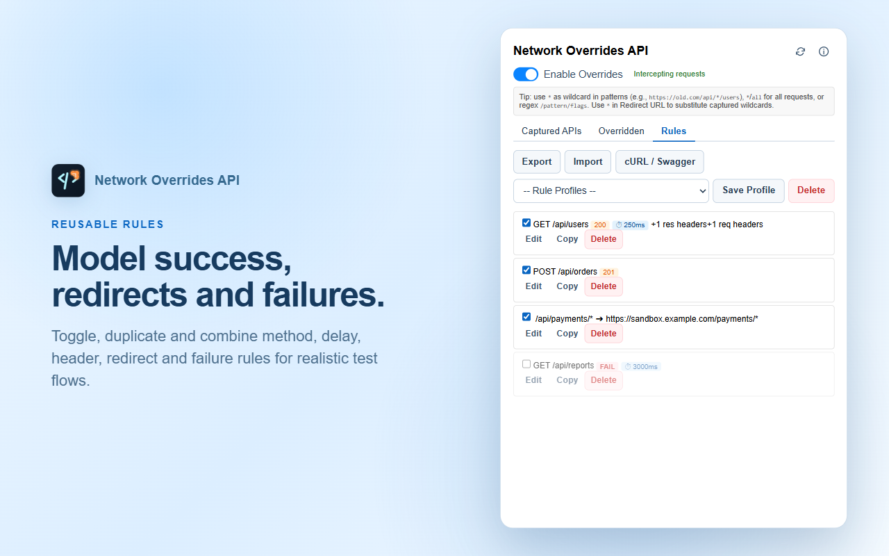
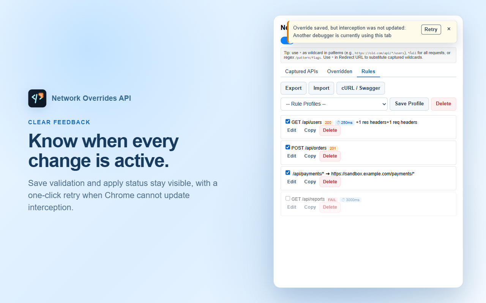

# Network Overrides DevTools

A Chrome/Edge DevTools extension that intercepts network responses and replaces their content during debugging. It uses `chrome.debugger` and the Chrome DevTools Protocol (Fetch domain) to pause requests, then returns a mocked body or redirects to a different URL based on configured rules.

🛒 **Chrome Web Store**: [Network Overrides API (DevTools)](https://chromewebstore.google.com/detail/network-overrides-api-dev/holdjgmcnpelgclhopiejilhhkfcmpba)

## Screenshots

| Live API capture                                           | Override editor                                                |
| ---------------------------------------------------------- | -------------------------------------------------------------- |
|  |  |

| Reusable override rules                                      | Save and apply feedback                                               |
| ------------------------------------------------------------ | --------------------------------------------------------------------- |
|  |  |

- **Real-time API Type & Tab Counters**: Live request counters next to each resource filter (`XHR (5)`, `Fetch (12)`, `Doc (1)`, `JS (3)`, `CSS (0)`) and in tab headers (`Captured APIs (15)`, `Overridden (3)`, `Rules (2)`).
- **High-Performance LRU Regex & Batch DOM Rendering**: LRU-cached `RegExp` pattern matching (`regexCache`) and `DocumentFragment` batch DOM rendering to handle heavy network traffic without UI lag.
- **JS Bundling & Minimal Dist Packaging**: Build pipeline automatically concatenates scripts into 5 clean JS bundles (`background.bundle.js`, `ui.bundle.js`, `panel.js`, `popup.js`, `devtools.js`) and cleans unbundled source files for optimal store uploads.
- **Modern Minimalist Vector Branding**: Sleek vector icons with 3 customizable design variants stored in `icons/concepts/`.
- **Persistent MV3 Worker Rehydration & Port Retries**: Automatic tab state rehydration from `chrome.storage.session` and automatic 150ms message port retries to handle Chrome background worker sleep/wake cycles gracefully.
- **Enable/disable** overrides per active tab via a toggle switch.
- **Per-rule enable/disable toggle**: disable an individual rule without deleting it; it stays visible (dimmed) and is skipped by the background worker until re-enabled.
- **HTTP method matching**: scope a rule to `GET`/`POST`/`PUT`/`PATCH`/`DELETE`, or leave it at `Any` to match every method (default, pre-filled from the captured request when available).
- **Import/export rules as JSON**: back up or share the current domain's rules as a downloadable file, and load them back in with a merge-or-replace choice.
- **Rule Profiles & Presets**: save and load named rule presets per domain to switch quickly between different testing scenarios.
- **Duplicate Rules**: 1-click clone any override rule directly in the rules list.
- **Request Headers & Response Headers Overriding**: inject or modify request headers (e.g. `Authorization: Bearer token`) during the request stage or extra response headers during the response stage.
- **Response Image & Visual Preview**: instant image preview (Base64 PNG/JPG, SVG) directly inside the editor modal.
- **Dynamic Captured Resource Filters**: toggle body capture for XHR, Fetch, Document, Script, or Stylesheet resources with real-time counters.
- **Three pattern matching modes** for override rules:
  - URL substring match (e.g. `/api/users`)
  - Wildcard `*` glob (e.g. `https://old.com/api/*/users` → `*` captures matching segments)
  - Regex `/pattern/flags` (e.g. `/api\/v1\/users\/\d+/i`)
  - `*` or `all` matches every request.
- **Three override types:**
  - **Override body**: Replace the response body with custom text or raw base64 content.
  - **Redirect URL**: Redirect the request to a different URL (supports `*` wildcard substitution from captured groups).
  - **Fail request**: Kill the request at the network layer with a chosen error reason — the page's `fetch`/XHR rejects as if the network failed.
- **Status, headers, delay, and fail mocking**: a body rule can force the response status (100–599), add or overwrite response headers, and delay the response up to 120 s; a fail rule kills the request at the network layer (`Failed`, `TimedOut`, `ConnectionRefused`, `NameNotResolved`, `InternetDisconnected`).
- **View captured APIs**, grouped by resource type (XHR, Fetch, JS, CSS, Img, Doc, WS, etc.), with real-time updates from the background service worker.
- **Search APIs** by URL substring.
- **One-click override creation**: Click any API in the list to open the modal and create/edit an override rule.
- **Dynamic Response Templating**: Insert dynamic placeholders into mock responses (`{{$uuid}}`, `{{$isoDate}}`, `{{$epoch}}`, `{{$randomEmail}}`, `{{$randomName}}`, `{{$randomInt(min, max)}}`, `{{$query(paramName)}}`).
- **Global Cross-Domain Rules**: Scope rules globally across all domains (`isGlobal`), highlighted with a `GLOBAL` badge in the rules list.
- **Request Payload Interception & Modification**: Modify outgoing request payloads (`postData`) during the CDP request stage.
- **HAR File Import**: Drag & drop or import `.har` files (HTTP Archive) to generate mock rules in bulk.
- **Traffic Analytics**: Track total overridden and failed request statistics per active tab.
- **Editor Keyboard Shortcuts**: Modal hotkeys `Ctrl+Enter` / `Cmd+Enter` to save and `Ctrl+Shift+F` / `Cmd+Shift+F` to format JSON.
- **Auto-fill response body**: When creating a new override, the current response body is automatically fetched from the background worker and pre-filled into the editor.
- **JSON formatting**: Auto-detect and format JSON bodies with a single button.
- **Copy cURL**: Copy any API request as a cURL command.
- **Manual rule editor** (DevTools panel only): Quickly add a rule without opening the modal.
- **Persistent storage**: All rules, profiles, and settings survive browser restarts via `chrome.storage.local`.

## Architecture

```
src/
├── background.ts            # Service Worker entrypoint bootstrap
├── devtools.ts              # Chrome DevTools extension tab registration
├── panel.ts                 # DevTools panel entrypoint & HAR streaming
├── popup.ts                 # Action popup entrypoint
├── ui.ts                    # Shared UI state & controller orchestration
├── shared.ts                # Shared OverrideRule, ApiEntry, and header types
├── tab-state.ts             # Per-tab state store, session persistence, & worker rehydration
├── utils.ts                 # Pattern matching, wildcard, dynamic templates, LRU regex cache, & origin helpers
├── background/
│   ├── api-capture.ts       # CDP Network event listener & API tracking
│   ├── debugger-controller.ts # chrome.debugger attach/detach & domain setup
│   ├── encoding.ts          # Base64 response body encoding helpers
│   ├── interceptor.ts       # Fetch.requestPaused request/response/fail interceptor
│   └── message-router.ts    # Background message listener & route handler
└── ui/
    ├── api-list.ts          # Render captured APIs & resource type counters
    ├── attach-status.ts     # Status badge renderer (green/red)
    ├── curl.ts              # cURL command generator & parser
    ├── dialogs.ts           # Prompt & confirmation modal dialogs
    ├── har.ts               # HAR (HTTP Archive) spec parser
    ├── headers-editor.ts    # Request & Response headers editor table/textarea
    ├── modal-controller.ts  # Override editor modal event handlers
    ├── modal.ts             # Override modal UI state & visibility
    ├── notifications.ts     # Toast notifications (success/warning/error)
    ├── persistence.ts       # Storage persistence queue & error handler
    ├── primitives.ts        # UI element creation primitives
    ├── profiles.ts          # Per-domain rule profiles & presets
    ├── rules-io-controller.ts # Import/export JSON rules & HAR/Swagger drag-and-drop
    ├── rules-list.ts        # Render saved rules list with action buttons & badges
    ├── swagger.ts          # Swagger / OpenAPI spec parser
    ├── toolbar-controller.ts# Enable toggle, search, refresh, tabs, & action buttons
    ├── types.ts             # UI state & elements interfaces
    └── view-utils.ts        # Highlighting & label formatting helpers

styles.css                   # CSS stylesheet entrypoint
styles/                      # Modular CSS stylesheets (base, feature, modal/rules, primitive, guide)
scripts/                     # Automation scripts:
├── bundle.mjs               # Bundles TypeScript outputs into 5 clean JS files & cleans dist/
├── package-store.mjs        # Store zip packager
├── smoke.mjs                # Real Chromium Playwright integration smoke test
└── capture-store-screenshots.mjs # Store assets screenshot generator

icons/                       # Active extension icons (16x16, 48x48, 128x128)
icons/concepts/              # 3 concept icon design variants (concept-1, concept-2, concept-3)
dist/                        # Bundled JavaScript outputs (background.bundle.js, ui.bundle.js, panel.js, popup.js, devtools.js)
devtools.html                # DevTools tab registrar page
panel.html                   # DevTools panel page
popup.html                   # Extension action popup page
guide.html                   # Bundled offline user guide
manifest.json                # Chrome Manifest V3 configuration
```

### Key flows

1. **Initialization**: `devtools.ts` creates a DevTools panel → `panel.ts` fires up UI + listens to `chrome.devtools.network` events (HAR + `onRequestFinished`). Popup uses `popup.ts` instead, without HAR or manual editor.

2. **Debugger attachment**: When "Enable Overrides" is checked, `background.ts` calls `chrome.debugger.attach` on the active tab, then enables `Network` and `Fetch` domains (both Request and Response stages). Detachment happens on disable, tab close, or debugger disconnect.

3. **Request interception** (`Fetch.requestPaused`):
   - **Request stage**: Checks override rules in precedence order. A rule with `failReason` kills the request via `Fetch.failRequest` (after `delayMs`, if set). Otherwise a rule with `redirectUrl` redirects via `Fetch.continueRequest` with a modified URL — wildcards (`*`) in the redirect URL are substituted with captured groups from the pattern match.
   - **Response stage**: Checks override rules for a body replacement. If found, `Fetch.fulfillRequest` sends the custom body (base64-encoded) with the original status and headers — unless the rule overrides them via `statusCode`/`responseHeaders` (same-name headers overwritten case-insensitively) — plus the `x-network-overrides: true` and `x-network-overrides-pattern` markers, delayed by `delayMs` if set. If no rule matches, XHR/Fetch response bodies are stored for later auto-fill via `Fetch.getResponseBody`.

4. **Recent API tracking**: `Network.requestWillBeSent` captures request metadata into an in-memory Map (per tabId), mirrored to `chrome.storage.session` under key `tabState_{tabId}` (debounced). Capped at 500 URLs and 100 bodies. On worker startup, this state is rehydrated from `chrome.storage.session` and the debugger is re-attached to tabs that were enabled; any legacy `recentApis_{tabId}` / `recentApiBodies_{tabId}` keys left over from older versions in `chrome.storage.local` are removed automatically.

5. **UI state**: `enabled`, per-domain rules (`overrides_{origin}`), and `apiSearchTerm` are persisted in `chrome.storage.local` and survive across DevTools sessions and browser restarts.

## Storage

Rule and UI state is stored in `chrome.storage.local` (permanent); per-tab runtime state is stored in `chrome.storage.session` (cleared when the browser exits):

| Key                  | Type                                                                      | Persistence                                                                                             |
| -------------------- | ------------------------------------------------------------------------- | ------------------------------------------------------------------------------------------------------- |
| `enabled`            | `boolean`                                                                 | Permanent — survives browser restart                                                                    |
| `overrides_{origin}` | `OverrideRule[]` (rules for one domain, e.g. `overrides_https://a.test`)  | Permanent — survives browser restart                                                                    |
| `apiSearchTerm`      | `string`                                                                  | Permanent — survives browser restart                                                                    |
| `tabState_{tabId}`   | per-tab snapshot (`enabled`, `origin`, `overrides`, captured APIs/bodies) | `chrome.storage.session` — cleared when the browser exits; rehydrated and re-attached on worker startup |

**Important**: Override rules are never lost. Recent API data is keyed by `tabId`, lives only for the current browser session, and is only visible when the same tab is active. Legacy keys from older extension versions are migrated automatically: a flat `overrides` list is moved to the current domain's `overrides_{origin}` key on UI load, and `recentApis_{tabId}` / `recentApiBodies_{tabId}` keys are removed from `chrome.storage.local` on worker startup.

## Pattern Reference

Override rules are evaluated in order; the first matching rule for a URL is used.

| Pattern                       | Matches                                                      |
| ----------------------------- | ------------------------------------------------------------ |
| `/api/users`                  | Any URL containing `/api/users`                              |
| `*` or `all`                  | Every request                                                |
| `https://site.com/api/*/list` | URLs matching the glob; `*` captures zero or more characters |
| `/\/api\/v\d+\/users/`        | Regex match (literal `/` delimiters, no flags)               |
| `/\/api\/user\/(\d+)/gi`      | Regex with flags `g` and `i`                                 |

In redirect URLs, `*` substitutes captured wildcards in order. For example:

- Pattern: `https://old.com/api/*/item/*`
- Redirect: `https://new.com/api/*/product/*`
- Request URL: `https://old.com/api/v2/item/5`
- Redirected to: `https://new.com/api/v2/product/5`

### Rule fields

Optional fields on an override rule:

| Field             | Type                       | Description                                                                                           |
| ----------------- | -------------------------- | ----------------------------------------------------------------------------------------------------- |
| `statusCode`      | optional integer 100–599   | Forces the mocked response status (body rules only).                                                  |
| `responseHeaders` | optional `{name, value}[]` | Added to the mocked response; same-name headers are overwritten case-insensitively (body rules only). |
| `delayMs`         | optional number 0–120000   | Delays the response/failure by N ms (body and fail rules).                                            |
| `failReason`      | optional enum              | Makes the rule fail the request at the network layer instead of answering.                            |

## Usage

### 1. Open the extension UI

Two entry points:

- **Popup**: Click the extension icon in the toolbar. Shows "Captured APIs", "Overridden", and "Rules" tabs.
- **DevTools panel**: Open DevTools (F12) → "Overrides" tab. Same UI plus a manual rule editor row at the top of the "Rules" tab.

### 2. Enable overrides

Toggle **Enable Overrides** on. The extension attaches the debugger to the current tab.

### 3. Capture APIs

Browse your application as normal. Requests appear in the **Captured APIs** tab, grouped by resource type (XHR, Fetch, JS, CSS, etc.). Use the search bar to filter by URL.

### 4. Create an override

Click any API in the list to open the override modal. You can also add a rule manually (DevTools panel only) by filling in the pattern, body, and clicking "Add override".

In the modal, choose:

- **Override body**: Enter custom response body text. Use `Text` mode for raw text or `Raw base64` for pre-encoded content. The **Format JSON** action appears when the body contains valid JSON.
- **Redirect to URL**: Enter the target URL. Use `*` to substitute wildcards captured from the pattern match.
- **Fail request**: Pick a fail reason (`Failed`, `TimedOut`, `ConnectionRefused`, `NameNotResolved`, `InternetDisconnected`) — the request fails at the network layer instead of receiving a response.

The advanced fields can override **Request Headers** and **Response Headers** in either Key–Value or Raw mode, force a **Status** (100–599), and set a **Delay** in milliseconds. Body and fail rules can use delay; combine `TimedOut` with a long delay to simulate a real timeout.

### 5. Manage rules

Switch to the **Rules** tab to edit, copy, delete, or enable/disable saved rules. A disabled rule stays visible but dimmed and is skipped by the background worker. Use **Export**/**Import** to share the current domain's rules; import provides explicit **Append rules** and **Replace rules** choices when rules already exist. The **Overridden** tab shows captured APIs currently matched by a rule.

### 6. Copy cURL

Each API entry has a "cURL" button that copies the request as a cURL command (method, headers, and post data included).

## Setup & Build

Requirements: Node.js 22+, Chrome or Edge.

```bash
npm install
npm run build
```

Load the extension:

1. Open `chrome://extensions` or `edge://extensions`
2. Enable **Developer mode**
3. Click **Load unpacked**
4. Select the project root (the folder containing `manifest.json`)

The `manifest.json` points to files in `dist/`, so re-run `npm run build` after any TypeScript changes.

## Scripts

```bash
npm run build          # Compile TypeScript → dist/
npm run lint           # ESLint over src/
npm test               # Build + run test suite
npm run coverage       # Build + run tests with coverage report
npm run ci:test        # CI pipeline (same as coverage)
npm run smoke          # Real-browser smoke test (loads the unpacked extension into Chromium)
npm run store:screenshots # Create versioned Store screenshots, promo tiles, and description note
npm run package:store  # Create a ZIP for Chrome Web Store / Edge Add-ons
```

## Development Standards

- **Formatting**: Prettier via lint-staged (pre-commit hook).
- **Commit messages**: Conventional Commits enforced by commitlint + Husky hooks.
- **Commit types**: `add`, `feat`, `fix`, `docs`, `style`, `refactor`, `perf`, `test`, `chore`, `ci`, `revert`, `build`.

## Testing

Tests live in `tests/` and cover:

- Pattern matching logic (`helpers.test.mjs`)
- UI behavior with DOM mocks (`ui-behavior.test.mjs`)
- Background debugger event handling (`background-flow.test.mjs`)
- Per-tab state store: session mirror, caps, dispose, rehydrate (`tab-state.test.mjs`)
- Entrypoint bootstrapping (`entrypoints.test.mjs`)

`npm run smoke` (`scripts/smoke.mjs`) additionally drives the real unpacked extension in Chromium via Playwright — attach status, interception, status override, network-layer fail, worker-restart recovery, cross-origin navigation, and attach failures. Run it before releases; it needs a display (headed browser) and downloads Chromium on first use.

`npm run store:screenshots` (`scripts/capture-store-screenshots.mjs`) loads the real extension with deterministic demo API data and recreates the four `1280x800` PNG files in `store-assets/screenshots/`. It also needs a headed Chromium session.

## CI

GitHub Actions (`.github/workflows/ci.yml`) installs dependencies, checks formatting with Prettier, lints commit messages with commitlint, runs tests with coverage, and uploads the coverage report as an artifact.

## Store Packaging

```bash
npm run package:store
```

Produces a ZIP in `release/` containing only the runtime files (`manifest.json`, `*.html`, `styles.css`, `dist/`, `icons/`) plus `privacy_policy.md`. `dist/` is cleaned and rebuilt first so stale compiled files never ship.

## Permissions

- `debugger` — required to intercept and modify network requests via Chrome DevTools Protocol.
- `storage` — required to persist override rules, settings, and recent API data.
- `host_permissions: <all_urls>` — required to attach the debugger to any tab.

## Limitations

- Overrides only apply to the tab currently attached to the debugger.
- Recent API data is capped at 500 URLs and 100 response bodies per tab.
- Recent API bodies are only stored for XHR and Fetch resource types by default. Configure `CAPTURED_BODY_TYPES` in `src/background.ts` to add more types.
- Recent API lists are keyed by `tabId` and reset when the tab is closed and reopened.
- The extension is designed for developer debugging only, not for end-user production use.
